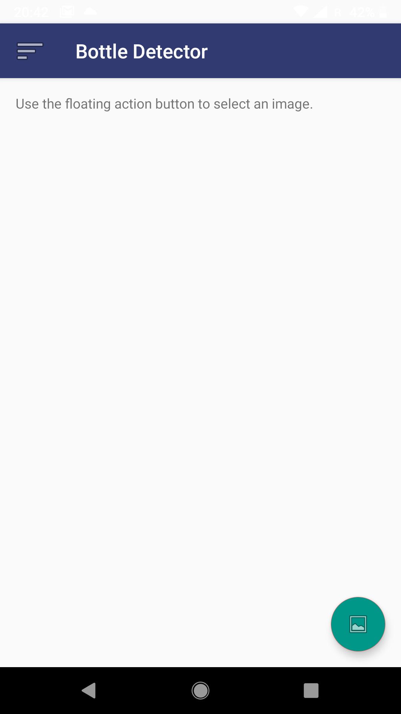
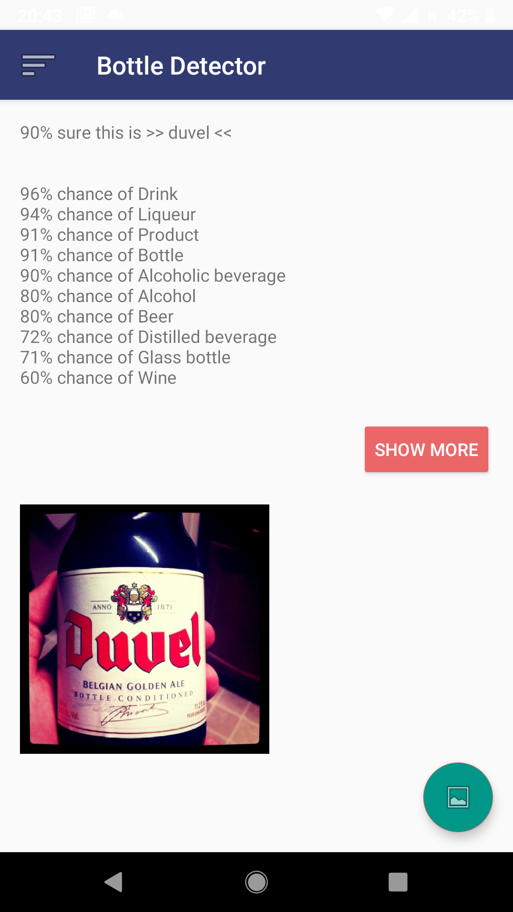
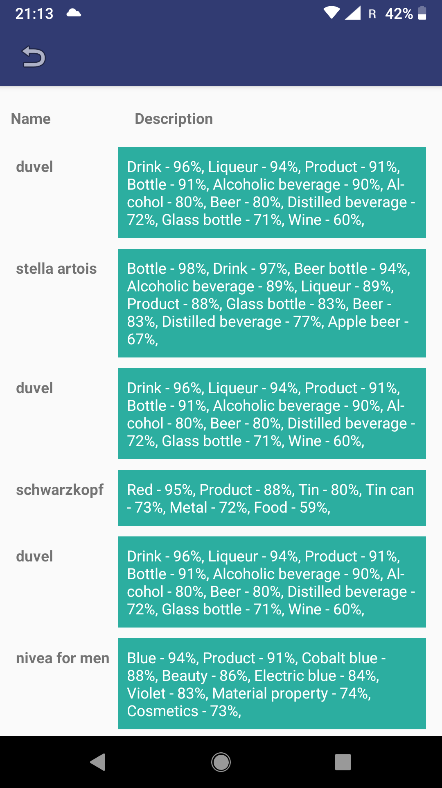

# Bottle Detector
to recognize and present information about the particular drink by taking and analyzing the photo of it

### What you can do with it
one can take a photo or choose one from the gallery, then easily send it to analysis, receive base facts about beverage (like type, name, quality) and also ask for detailed information (opinions, taste descriptions etc.)

### How it works
majority of actions is performed in the background and no advanced operations are executed on the smartphone
* app connects to the Google API Vision
* authenticates the user
* computes in the Google Cloud
* sends JSON with data
* converts JSON, picks the most important elements and presents them to you
* stores data in SQLite database to enable access to previous searches

  
  
  

### Technologies
* Java
* HTML5/CSS

#### Built with
[Google Cloud Platform](https://cloud.google.com/vision/)